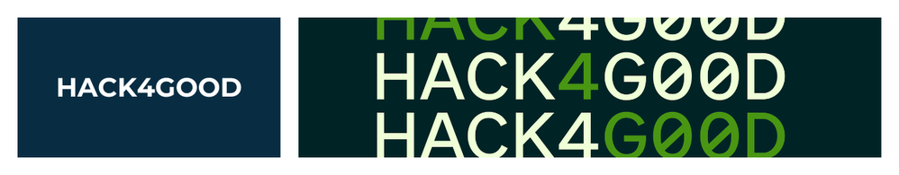

A ServiceNow app to capture ideas for developing solutions as part of the Hack4Good initiative. This repository enables the ServiceNow community to submit innovative project proposals aimed at creating positive social impact through technology.

> Interested in our other ServiceNow Hacktoberfest projects? See the main repository [here](https://github.com/ServiceNowDevProgram/Hacktoberfest) or see our official blog post [here](https://devlink.sn/hacktoberfest).

## A Special Partnership: Hack4Good

We are thrilled to announce that we are partnering with our friends at Hack4Good!

Typically, ServiceNow Hack4Good is a hackathon where developers, partners, and customers create real-world solutions for nonprofit organizations. After two successful years at the Knowledge conference, Hack4Good is spreading its wings into more year-round events, and our Hacktoberfest is one of its first stops!

This project is a new **Hack4Good Ideation Portal**. The records you contribute will be ideas and app suggestions that will fuel future Hack4Good initiatives. You'll learn how to contribute records to a ServiceNow repo, and your contributions will directly support future social impact projects.

Want to see what ideas have been submitted? Scroll down to see Seubmitted idea, or visit `https://YOUR-INSTANCE.service-now.com/h4g?id=h4g_submitted_ideas` (replace `YOUR-INSTANCE` with your ServiceNow instance subdomain) in your own instance after importing this repository.

> [!IMPORTANT]
> 🔔🔔🔔 
> **_CONTRIBUTORS must follow all guidelines in [CONTRIBUTING.md](CONTRIBUTING.md)_** or run the risk of having your Pull Requests labeled non-compliant or as spam. 
> 🔔🔔🔔

## We invite you to contribute!

To contribute, just follow these steps:

1. Fork this repo (you get a point just by forking!)
2. Go to your ServiceNow instance
3. Go to a Source Control-enabled Studio:
    - On Zurich and above: `ServiceNow Studio`
    - On Yokohama and earlier: `App Engine Studio` or `Legacy Studio`
4. Using your fork of this application, import it from source control, using the `main` branch:
    **Note:** If this is your first time using source control in this instance, create a credential as described by Earl [here](https://www.servicenow.com/community/developer-advocate-blog/source-control-in-servicenow-studio-complete-walkthrough/ba-p/3356303#create-a-credential-in-servicenow).
    - [SNS Import Instructions](http://servicenow.com/docs/bundle/zurich-application-development/page/build/servicenow-studio/task/sns-sc-import-app-source-control.html)
    - [AES Import Instructions](http://servicenow.com/docs/bundle/yokohama-application-development/page/build/app-engine-studio/task/source-control-import.html)
    - [Legacy Studio Import Instructions](https://www.servicenow.com/docs/bundle/yokohama-application-development/page/build/applications/task/t_ImportAppFromSourceControl.html)
5. Using a Source Control-enabled Studio, create a new branch and switch to it:
    - [SNS Create Branch Instructions](https://www.servicenow.com/docs/bundle/zurich-application-development/page/build/servicenow-studio/concept/sns-sc-create-versions-branches-git.html#title_sns-sc-create-repo-branch)
    - [AES Create Branch Instructions](https://www.servicenow.com/docs/bundle/yokohama-application-development/page/build/app-engine-studio/concept/create-versions-branches-git.html#title_source-control-create-branch)
    - [Legacy Studio Create Branch Instructions](https://www.servicenow.com/docs/bundle/yokohama-application-development/page/build/applications/task/t_CreateBranch.html)
6. Open your preferred studio experience
7. Go to the H4G portal, and submit a new idea: Open `https://YOUR-INSTANCE.service-now.com/h4g` (replace `YOUR-INSTANCE` with your ServiceNow instance subdomain)
9. Using a Source Control-enabled Studio, commit your changes to source control:
    - [SNS Commit Changes Instructions](https://www.servicenow.com/docs/bundle/zurich-application-development/page/build/servicenow-studio/task/sns-sc-commit-changes-to-repository.html)
    - [AES Commit Changes Instructions](https://www.servicenow.com/docs/bundle/yokohama-application-development/page/build/app-engine-studio/task/source-control-commit-changes.html)
    - [Legacy Studio Commit Changes Instructions](https://www.servicenow.com/docs/bundle/yokohama-application-development/page/build/applications/task/t_CommitChanges.html)
10. Submit a pull request to the ServiceNowDevProgram/Hack4Good-Idea-Submission `main` branch

That's it! More detailed contribution instructions can be found [here](CONTRIBUTING.md).

## Submitted ideas

See what other community members submitted.

<!-- ideas:start -->

_Updated automatically on merge to `main`._

| Project | Focus area | Submitted by | Created (UTC) |
|---|---|---|---|
| [MentalHealthLine – Instant Mental Health Support Network](95b5d2b7938832108543b2597bba109c/update/x_snc_hack4good_0_hack4good_proposal_c0b5adc3935c3e10cfccfcb6dd03d656.xml) | 🧪 Cause and Cure | <a href="https://github.com/debendu-das"> @debendu-das</a> | 2025-10-04 |
| [Corporate Social Responsibility Management](95b5d2b7938832108543b2597bba109c/update/x_snc_hack4good_0_hack4good_proposal_b68a1dc7c398b210b541bb4599013158.xml) | 🌱 Sustainability and Decarbonization | <a href="https://github.com/animeshdasgit"> @animeshdasgit</a> | 2025-10-04 |
| [ResQNet – A modern, tech-savvy name combining “Rescue” and “Network.”](95b5d2b7938832108543b2597bba109c/update/x_snc_hack4good_0_hack4good_proposal_ffbb0d0fc314b2104e08bd43e4013158.xml) | 🆘 Disaster and Community Support | <a href="https://github.com/shivamvish160"> @shivamvish160</a> | 2025-10-04 |
| [EqualAccess - Disability Resource Coordination Platform](95b5d2b7938832108543b2597bba109c/update/x_snc_hack4good_0_hack4good_proposal_44b4890793983e10cfccfcb6dd03d610.xml) | 🧪 Cause and Cure | <a href="https://github.com/debendu-das"> @debendu-das</a> | 2025-10-04 |
| [Employee health buddy](95b5d2b7938832108543b2597bba109c/update/x_snc_hack4good_0_hack4good_proposal_54186c07c394b210b541bb45990131ea.xml) | 🧪 Cause and Cure | <a href="https://github.com/animeshdasgit"> @animeshdasgit</a> | 2025-10-04 |
| [Water Sentinel: Smart Leak & Water Loss Response](95b5d2b7938832108543b2597bba109c/update/x_snc_hack4good_0_hack4good_proposal_ea13240bc358f610d9d679ec05013112.xml) | 🌱 Sustainability and Decarbonization | <a href="https://github.com/vhudlikar"> @vhudlikar</a> | 2025-10-04 |
| [Financial goal planner](95b5d2b7938832108543b2597bba109c/update/x_snc_hack4good_0_hack4good_proposal_76a63ffec350b210b541bb4599013122.xml) | 🧩 Other | <a href="https://github.com/animeshdasgit"> @animeshdasgit</a> | 2025-10-04 |
| [E-Cycle Flow: Circular E-Waste Management](95b5d2b7938832108543b2597bba109c/update/x_snc_hack4good_0_hack4good_proposal_7d7adb72c3d0f610d9d679ec05013198.xml) | 🌱 Sustainability and Decarbonization | <a href="https://github.com/vhudlikar"> @vhudlikar</a> | 2025-10-04 |
| [Info-Guardian: Digital Literacy & Misinformation Training](95b5d2b7938832108543b2597bba109c/update/x_snc_hack4good_0_hack4good_proposal_c70ecffec350f610d9d679ec050131ef.xml) | 🎓 Education and Youth Services | <a href="https://github.com/vhudlikar"> @vhudlikar</a> | 2025-10-04 |
| [Queer and Trans Mutual Aid Network](95b5d2b7938832108543b2597bba109c/update/x_snc_hack4good_0_hack4good_proposal_b0299aba835032104d485dc6feaad3cd.xml) | 🆘 Disaster and Community Support | <a href="https://github.com/becksbyte"> @becksbyte</a> | 2025-10-04 |
| [Food4ALL](95b5d2b7938832108543b2597bba109c/update/x_snc_hack4good_0_hack4good_proposal_d062817a83d43210ba4ec1e6feaad324.xml) | 🌱 Sustainability and Decarbonization | <a href="https://github.com/Mexiprince"> @Mexiprince</a> | 2025-10-03 |
| [Public Health Check Camp Coordination](95b5d2b7938832108543b2597bba109c/update/x_snc_hack4good_0_hack4good_proposal_008e81bec398ba10e4deb132b40131ba.xml) | 🆘 Disaster and Community Support | <a href="https://github.com/Rampriya-S"> @Rampriya-S</a> | 2025-10-03 |
| [HomesteadNow](95b5d2b7938832108543b2597bba109c/update/x_snc_hack4good_0_hack4good_proposal_110ff4b683d43210ba4ec1e6feaad35a.xml) | 🆘 Disaster and Community Support | <a href="https://github.com/Mexiprince"> @Mexiprince</a> | 2025-10-03 |
| [Sustain Wear](95b5d2b7938832108543b2597bba109c/update/x_snc_hack4good_0_hack4good_proposal_7d46007a83903210ba4ec1e6feaad3d3.xml) | 🌱 Sustainability and Decarbonization | <a href="https://github.com/Mexiprince"> @Mexiprince</a> | 2025-10-03 |
| [First Aid Near Me](95b5d2b7938832108543b2597bba109c/update/x_snc_hack4good_0_hack4good_proposal_6e18bf6293543e106304bd6cebba10ff.xml) | 🧪 Cause and Cure | <a href="https://github.com/Atul-LNG"> @Atul-LNG</a> | 2025-10-03 |
| [Rebuild Now - Post-disaster infrastructure and work management](95b5d2b7938832108543b2597bba109c/update/x_snc_hack4good_0_hack4good_proposal_1d91536a3314b6100b8226323d5c7b0c.xml) | 🆘 Disaster and Community Support | <a href="https://github.com/SapphicFire"> @SapphicFire</a> | 2025-10-03 |
| [SafeLocatorNow - Locate a safe spot quickly and safely during natural disaster occurances.](95b5d2b7938832108543b2597bba109c/update/x_snc_hack4good_0_hack4good_proposal_c83a4b6653503210030191e0a0490e13.xml) | 🆘 Disaster and Community Support | <a href="https://github.com/DanielMadsenDK"> @DanielMadsenDK</a> | 2025-10-03 |
| [Disaster Response Youth Volunteer Coordination](95b5d2b7938832108543b2597bba109c/update/x_snc_hack4good_0_hack4good_proposal_3fbfac2ac39c3a10e4deb132b40131fa.xml) | 🆘 Disaster and Community Support | <a href="https://github.com/Rampriya-S"> @Rampriya-S</a> | 2025-10-03 |
| [Community Circle](95b5d2b7938832108543b2597bba109c/update/x_snc_hack4good_0_hack4good_proposal_200bec22c3103610e89b341d050131e6.xml) | 🆘 Disaster and Community Support | <a href="https://github.com/stefanintech"> @stefanintech</a> | 2025-10-03 |
| [Parental Leave & Childcare Tracker](95b5d2b7938832108543b2597bba109c/update/x_snc_hack4good_0_hack4good_proposal_cbd457da93d472107b1bf24cdd03d6df.xml) | 🧪 Cause and Cure | <a href="https://github.com/juhikumarimodi6"> @juhikumarimodi6</a> | 2025-10-02 |
| [Report Carbon Emissions](95b5d2b7938832108543b2597bba109c/update/x_snc_hack4good_0_hack4good_proposal_ba893ade53d0b2104834d2a0a0490e08.xml) | 🌱 Sustainability and Decarbonization | <a href="https://github.com/raghavs046"> @raghavs046</a> | 2025-10-02 |
| [EcoTrackr](95b5d2b7938832108543b2597bba109c/update/x_snc_hack4good_0_hack4good_proposal_77029e92c3943a108dbc32f1b4013106.xml) | 🌱 Sustainability and Decarbonization | <a href="https://github.com/niamccash"> @niamccash</a> | 2025-10-02 |
| [Carbon Footprint Tracker](95b5d2b7938832108543b2597bba109c/update/x_snc_hack4good_0_hack4good_proposal_9c16b1d693dc32107b1bf24cdd03d609.xml) | 🌱 Sustainability and Decarbonization | <a href="https://github.com/juhikumarimodi6"> @juhikumarimodi6</a> | 2025-10-02 |
| [Employee Wellness Tracker](95b5d2b7938832108543b2597bba109c/update/x_snc_hack4good_0_hack4good_proposal_2af991d2935c32107b1bf24cdd03d69a.xml) | 🧪 Cause and Cure | <a href="https://github.com/juhikumarimodi6"> @juhikumarimodi6</a> | 2025-10-02 |
| [Multilingual Community Support](95b5d2b7938832108543b2597bba109c/update/x_snc_hack4good_0_hack4good_proposal_662164dec3583210abae3eec05013122.xml) | 🧩 Other | <a href="https://github.com/JonSandoval"> @JonSandoval</a> | 2025-10-02 |
| [ImpactConnect - Skills for Social Good](95b5d2b7938832108543b2597bba109c/update/x_snc_hack4good_0_hack4good_proposal_b6f854d283d0f610e6db99d6feaad34c.xml) | 🧩 Other | <a href="https://github.com/earlduque"> @earlduque</a> | 2025-10-02 |
| [Community Health Resource Navigator](95b5d2b7938832108543b2597bba109c/update/x_snc_hack4good_0_hack4good_proposal_f8af424a8310fa1025abc070ceaad332.xml) | 🧪 Cause and Cure | <a href="https://github.com/snamjosh"> @snamjosh</a> | 2025-10-01 |
| [SkillBridge](95b5d2b7938832108543b2597bba109c/update/x_snc_hack4good_0_hack4good_proposal_af29310e83d472106705c710feaad36f.xml) | 🎓 Education and Youth Services | <a href="https://github.com/Paulsylo25"> @Paulsylo25</a> | 2025-10-01 |
| [Environmental Monitoring & Alerts](95b5d2b7938832108543b2597bba109c/update/x_snc_hack4good_0_hack4good_proposal_431cd5bd83943a1025abc070ceaad33b.xml) | 🆘 Disaster and Community Support | <a href="https://github.com/snamjosh"> @snamjosh</a> | 2025-10-01 |
| [MealBridge](95b5d2b7938832108543b2597bba109c/update/x_snc_hack4good_0_hack4good_proposal_b1305f7dc3903210e89b341d05013130.xml) | 🌱 Sustainability and Decarbonization | <a href="https://github.com/stefanintech"> @stefanintech</a> | 2025-10-01 |
| [Local Volunteer Opportunities](95b5d2b7938832108543b2597bba109c/update/x_snc_hack4good_0_hack4good_proposal_41bc31f1c3d03210d7b8bd0ed40131fb.xml) | 🆘 Disaster and Community Support | <a href="https://github.com/brenduh"> @brenduh</a> | 2025-09-30 |
| [Good4Me](95b5d2b7938832108543b2597bba109c/update/x_snc_hack4good_0_hack4good_proposal_a056e83553107610db6151a0a0490ec2.xml) | 🧪 Cause and Cure | <a href="https://github.com/earlduque"> @earlduque</a> | 2025-09-30 |
<!-- ideas:end -->

